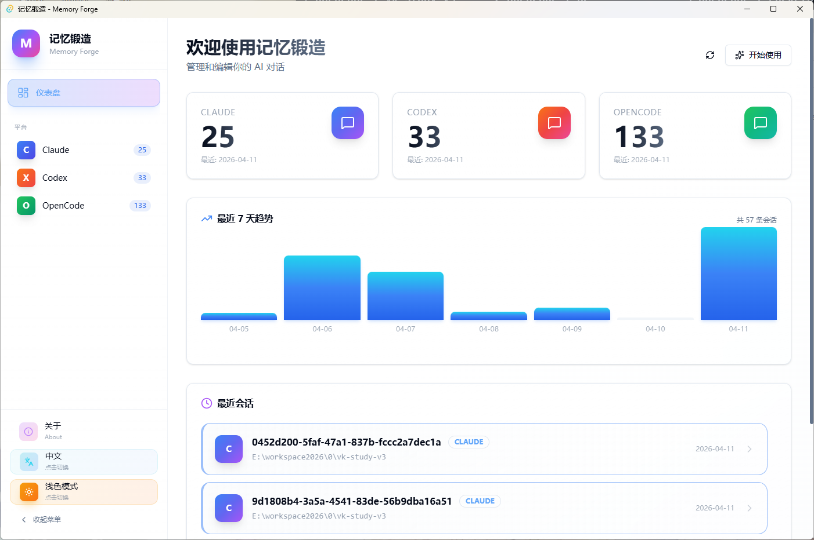
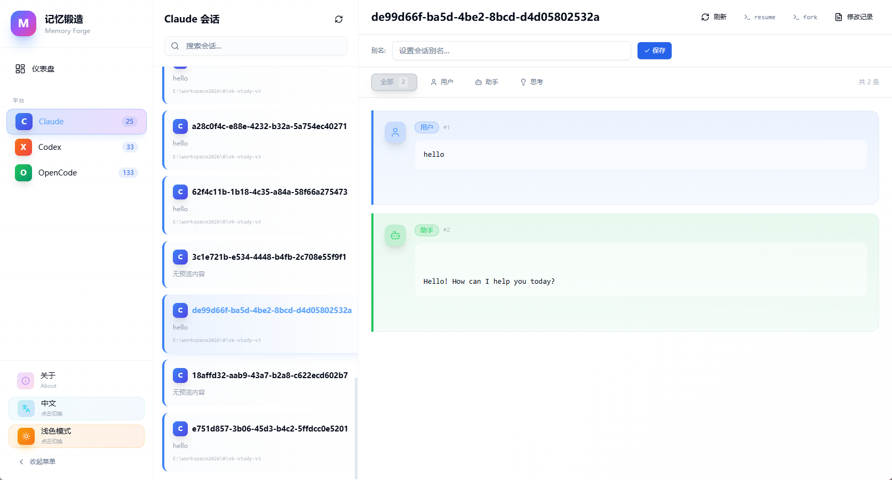
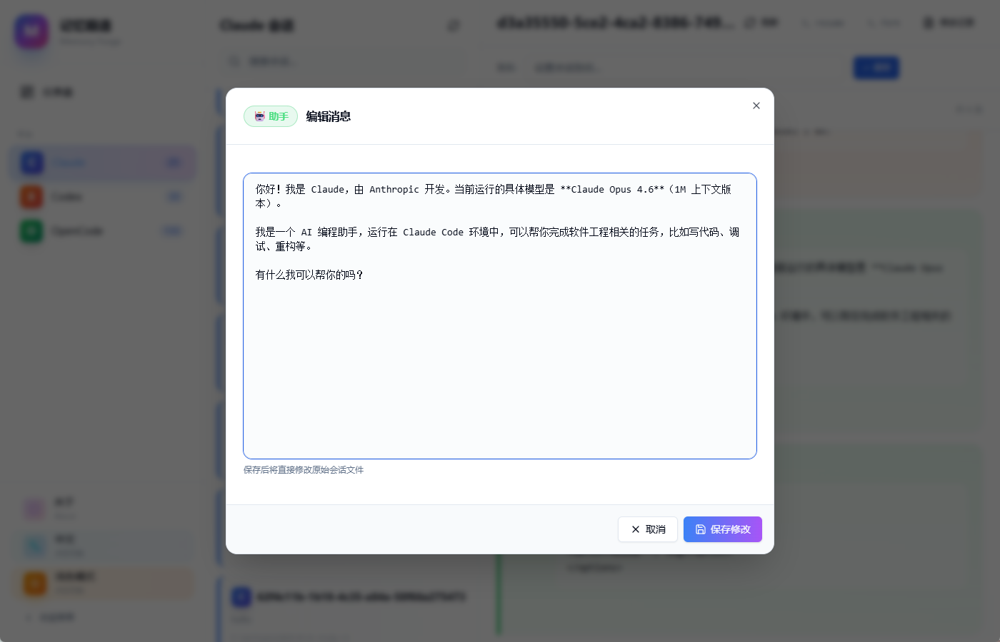
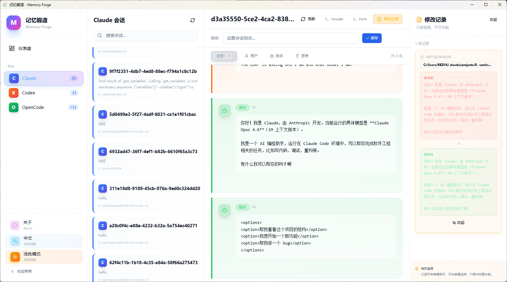
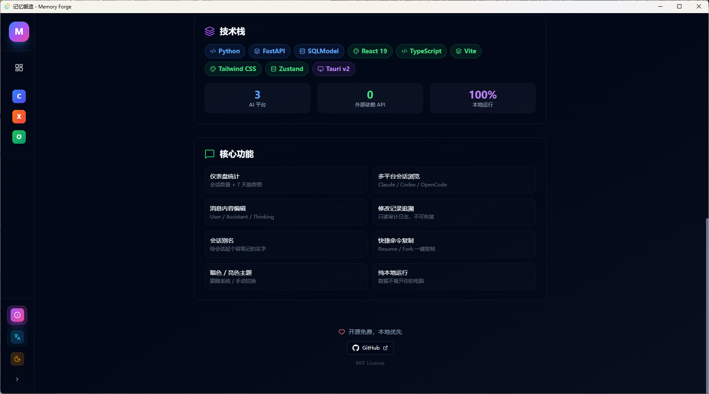
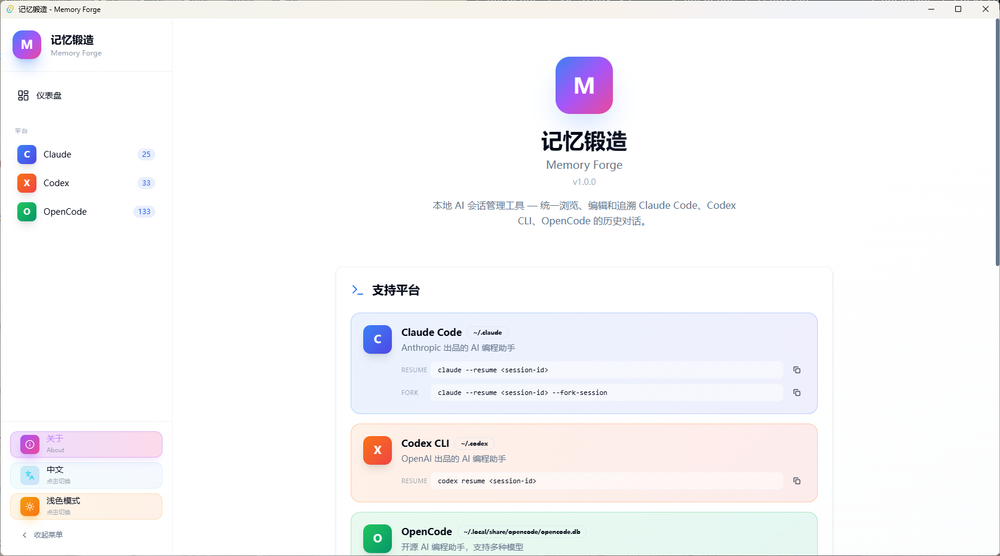
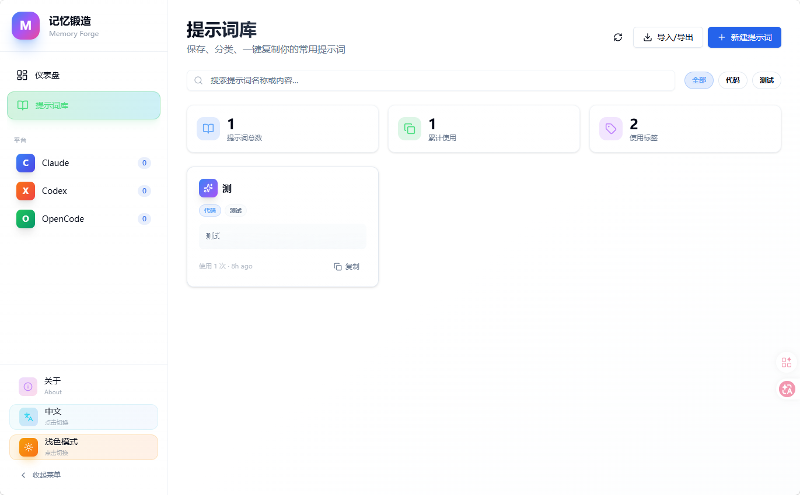

<div align="center">

# 🔥 Memory Forge

**Stop resetting. Start editing.**

本地 AI 会话管理工具 — 改写 AI 记忆，精准操控对话历史

[](LICENSE)
[](https://python.org)
[](https://react.dev)
[](https://tauri.app)

**[English](#english)** · **[中文](#中文)**

</div>

---

> [!NOTE]
> **🚀 A new version is available: [memory-forge-rs](https://github.com/voidcraft-dev/memory-forge-rs)**
> v3 is a full rewrite in Rust — no Python, no server, just open and use.
> This repo (v2, Python backend) is kept for reference. **New users should use [memory-forge-rs](https://github.com/voidcraft-dev/memory-forge-rs).**
>
> **🚀 新版本已发布：[memory-forge-rs](https://github.com/voidcraft-dev/memory-forge-rs)**
> v3 用 Rust 完全重写，无需 Python，无需服务器，打开即用。
> 本仓库（v2，Python 后端）保留作参考，**新用户请使用 [memory-forge-rs](https://github.com/voidcraft-dev/memory-forge-rs)。**

<a id="english"></a>

## What is Memory Forge?

**Stop resetting. Start editing.**

AI went off track? Don't restart — edit the history directly.

Memory Forge lets you modify AI's "memory" in Claude Code / Codex / OpenCode: inject context, fix errors, remove noise, then seamlessly continue the conversation.

**100% local, zero cloud dependency.** Your data never leaves your machine.

## 📸 Screenshots

<div align="center">
  
  
</div>

<div align="center">
  
  
</div>

<div align="center">
  
  
</div>

<div align="center">
  
</div>

## ✨ Features

- 🧠 **Memory Manipulation** — Edit any message in AI conversation history. Inject context, remove noise, fix AI's wrong assumptions — then seamlessly continue the session.
- 📊 **Dashboard** — Session statistics + 7-day trend chart
- 💬 **Multi-platform browsing** — Claude Code / Codex CLI / OpenCode in one view
- 📝 **Edit audit log** — Read-only change tracking with diff view
- 🏷️ **Session aliases** — Give sessions memorable names
- 📋 **Quick command copy** — Resume / Fork commands one-click copy
- 🌗 **Dark / Light theme** — Follow system or manual toggle
- 📚 **Prompt Library** — Save, manage & one-click copy frequently used prompts
- 🔒 **100% local** — No data leaves your computer

## 🖥️ Supported Platforms

| Platform | Resume Command | Fork Command | Data Path |
|----------|---------------|--------------|-----------|
| **Claude Code** | `claude --resume <id>` | `claude --resume <id> --fork-session` | `~/.claude` |
| **Codex CLI** | `codex resume <id>` | — | `~/.codex` |
| **OpenCode** | `opencode -s <id>` | `opencode -s <id> --fork` | `~/.local/share/opencode/opencode.db` |

## 📦 Installation

### Desktop App (Recommended)

Download the latest release for your platform:

| Platform | Format | Notes |
|----------|--------|-------|
| **Windows** | `.exe` installer / `.zip` portable | NSIS installer or unzip & run |
| **macOS** | `.dmg` | Drag to Applications |
| **Linux** | `.AppImage` / `.deb` | AppImage is portable, no install needed |

> Check the [Releases](https://github.com/voidcraft-dev/memory-forge/releases) page for downloads.

### From Source

#### Prerequisites

- [Node.js](https://nodejs.org) 18+
- [Python](https://python.org) 3.10+
- [Rust](https://rustup.rs) (only for desktop app build)

#### Option 1: One-Click Launch (Windows)

Double-click `start.bat` — it will automatically:
1. Create Python virtual environment
2. Install backend dependencies
3. Build frontend (if not built)
4. Start backend server (serves both API + frontend)
5. Open browser at `http://localhost:8000`

#### Option 2: Development Mode

```bash
# Terminal 1 — Backend
cd backend
python -m venv .venv
.venv\Scripts\activate    # Windows | source .venv/bin/activate  # macOS/Linux
pip install -r requirements.txt
uvicorn app.main:app --reload --port 8000

# Terminal 2 — Frontend
npm install
npm run dev
# Open http://localhost:5173 (Vite proxies /api to backend)
```

#### Build Desktop App

```bash
# Full build (backend + frontend + Tauri app + portable)
python build.py

# Or step by step
python build.py --backend    # Build Python backend with PyInstaller
python build.py --frontend   # Build frontend with Vite
python build.py --tauri      # Build Tauri desktop app (installer)
python build.py --portable   # Build portable ZIP (no install needed)
```

## 🏗️ Project Structure

```
memory-forge/
├── backend/              # Python FastAPI backend
│   ├── app/
│   │   ├── main.py       # Entry point, serves frontend + API
│   │   ├── config.py     # Configuration & path resolution
│   │   ├── db.py         # Database setup (SQLite + SQLModel)
│   │   ├── models.py     # Data models
│   │   ├── routes/
│   │   │   └── api.py    # REST API endpoints
│   │   └── services/
│   │       ├── commands.py      # CLI command builder
│   │       ├── edit_log.py      # Audit logging
│   │       ├── aliases.py       # Session aliases
│   │       └── platforms/       # Platform adapters
│   │           ├── claude.py
│   │           ├── codex.py
│   │           └── opencode.py
│   ├── memoryforge-backend.spec # PyInstaller spec
│   └── requirements.txt
├── src/                  # React frontend
│   ├── components/       # UI components
│   ├── pages/            # Page views (Dashboard, About)
│   ├── stores/           # Zustand state management
│   └── lib/              # Utilities & API client
├── src-tauri/            # Tauri v2 desktop shell
├── build.py              # Build script (backend + frontend + desktop)
├── start.bat             # One-click launcher (Windows)
└── package.json
```

## 🛠️ Tech Stack

| Layer | Technologies |
|-------|-------------|
| **Backend** | Python · FastAPI · SQLModel · SQLite |
| **Frontend** | React 19 · TypeScript · Vite · Tailwind CSS · Zustand |
| **Desktop** | Tauri v2 · Rust |

## 🤝 Contributing

Contributions are welcome! Feel free to:

1. Fork the repository
2. Create a feature branch (`git checkout -b feature/amazing-feature`)
3. Commit your changes (`git commit -m 'Add amazing feature'`)
4. Push to the branch (`git push origin feature/amazing-feature`)
5. Open a Pull Request

## 📄 License

This project is licensed under the [MIT License](LICENSE).

## 🌍 Community

Thank you to the LINUX DO community for your support!
感谢 LINUX DO 社区的支持！

<a href="https://linux.do">
  
</a>

Tech discussions, AI frontiers, AI experience sharing — all at [LINUX DO](https://linux.do)!

## 👤 Author

**VoidCraft** — [GitHub](https://github.com/voidcraft-dev)

> *Full-stack developer | AI tools & automation | Building things from the void ✦*

---

<a id="中文"></a>

## 什么是记忆锻造？

**停止重开，直接编辑。**

AI 对话走偏了？别重新开始 — 直接改掉历史记录。

记忆锻造让你在 Claude Code / Codex / OpenCode 中直接编辑 AI 的"记忆"：注入上下文、纠正错误、删除废话，然后无缝继续对话。

**100% 本地运行，零云端依赖。** 你的数据不会离开你的电脑。

## 📸 应用截图

<div align="center">
  
  
</div>

<div align="center">
  
  
</div>

<div align="center">
  
  
</div>

## ✨ 功能特性

- 🧠 **记忆操控** — 编辑 AI 对话历史中的任意消息。注入上下文、删除噪音、纠正 AI 的错误假设 — 然后无缝继续会话。
- 📊 **仪表盘统计** — 会话数量 + 7 天趋势图
- 💬 **多平台会话浏览** — Claude Code / Codex CLI / OpenCode 统一视图
- 📝 **修改记录追溯** — 只读审计日志，支持 diff 对比
- 🏷️ **会话别名** — 给会话起一个容易记的名字
- 📋 **快捷命令复制** — Resume / Fork 命令一键复制
- 🌗 **暗色 / 亮色主题** — 跟随系统或手动切换
- 📚 **提示词库** — 保存、管理常用提示词，支持一键复制
- 🔒 **纯本地运行** — 数据不离开你的电脑

## 🖥️ 支持平台

| 平台 | 恢复命令 | 分支命令 | 数据路径 |
|------|---------|---------|---------|
| **Claude Code** | `claude --resume <id>` | `claude --resume <id> --fork-session` | `~/.claude` |
| **Codex CLI** | `codex resume <id>` | — | `~/.codex` |
| **OpenCode** | `opencode -s <id>` | `opencode -s <id> --fork` | `~/.local/share/opencode/opencode.db` |

## 📦 安装方式

### 桌面应用（推荐）

下载对应平台的最新版本：

| 平台 | 格式 | 说明 |
|------|------|------|
| **Windows** | `.exe` 安装包 / `.zip` 便携版 | NSIS 安装包或解压即用 |
| **macOS** | `.dmg` | 拖入 Applications 即可 |
| **Linux** | `.AppImage` / `.deb` | AppImage 免安装，双击运行 |

> 前往 [Releases](https://github.com/voidcraft-dev/memory-forge/releases) 页面下载。

### 从源码运行

#### 前置要求

- [Node.js](https://nodejs.org) 18+
- [Python](https://python.org) 3.10+
- [Rust](https://rustup.rs)（仅桌面应用构建需要）

#### 方式一：一键启动（Windows）

双击 `start.bat`，自动完成：
1. 创建 Python 虚拟环境
2. 安装后端依赖
3. 构建前端（如果未构建）
4. 启动后端服务（同时提供 API + 前端静态文件）
5. 自动打开浏览器 `http://localhost:8000`

#### 方式二：开发模式

```bash
# 终端 1 — 后端
cd backend
python -m venv .venv
.venv\Scripts\activate   # Windows | source .venv/bin/activate  # macOS/Linux
pip install -r requirements.txt
uvicorn app.main:app --reload --port 8000

# 终端 2 — 前端
npm install
npm run dev
# 打开 http://localhost:5173（Vite 代理 /api 到后端）
```

#### 构建桌面应用

```bash
# 完整构建（后端 + 前端 + Tauri 应用 + 便携版）
python build.py

# 或分步构建
python build.py --backend    # 用 PyInstaller 打包 Python 后端
python build.py --frontend   # 用 Vite 构建前端
python build.py --tauri      # 构建 Tauri 桌面应用（安装包）
python build.py --portable   # 构建便携版 ZIP（免安装）
```

## 🏗️ 项目结构

```
memory-forge/
├── backend/              # Python FastAPI 后端
│   ├── app/
│   │   ├── main.py       # 入口，集成前端静态文件服务
│   │   ├── config.py     # 配置 & 路径解析
│   │   ├── db.py         # 数据库（SQLite + SQLModel）
│   │   ├── models.py     # 数据模型
│   │   ├── routes/
│   │   │   └── api.py    # REST API 端点
│   │   └── services/
│   │       ├── commands.py      # CLI 命令构建器
│   │       ├── edit_log.py      # 审计日志
│   │       ├── aliases.py       # 会话别名
│   │       └── platforms/       # 平台适配器
│   │           ├── claude.py
│   │           ├── codex.py
│   │           └── opencode.py
│   ├── memoryforge-backend.spec # PyInstaller 配置
│   └── requirements.txt
├── src/                  # React 前端
│   ├── components/       # UI 组件
│   ├── pages/            # 页面视图（仪表盘、关于）
│   ├── stores/           # Zustand 状态管理
│   └── lib/              # 工具函数 & API 客户端
├── src-tauri/            # Tauri v2 桌面壳
├── build.py              # 构建脚本（后端 + 前端 + 桌面应用）
├── start.bat             # 一键启动（Windows）
└── package.json
```

## 🛠️ 技术栈

| 层级 | 技术 |
|------|------|
| **后端** | Python · FastAPI · SQLModel · SQLite |
| **前端** | React 19 · TypeScript · Vite · Tailwind CSS · Zustand |
| **桌面** | Tauri v2 · Rust |

## 🤝 参与贡献

欢迎贡献！你可以：

1. Fork 本仓库
2. 创建功能分支 (`git checkout -b feature/amazing-feature`)
3. 提交更改 (`git commit -m 'Add amazing feature'`)
4. 推送到分支 (`git push origin feature/amazing-feature`)
5. 发起 Pull Request

## 📄 开源协议

本项目基于 [MIT 协议](LICENSE) 开源。

## 🌍 社区

感谢 LINUX DO 社区的支持！
Thank you to the LINUX DO community for your support!

<a href="https://linux.do">
  
</a>

技术讨论、人工智能前沿、人工智能体验分享——尽在 [LINUX DO](https://linux.do)！

## 👤 作者

**VoidCraft** — [GitHub](https://github.com/voidcraft-dev)

> *Full-stack developer | AI tools & automation | Building things from the void ✦*
